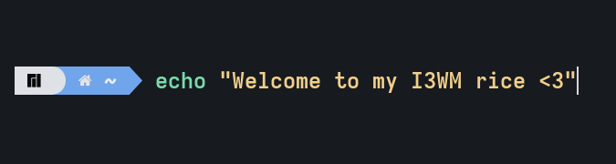
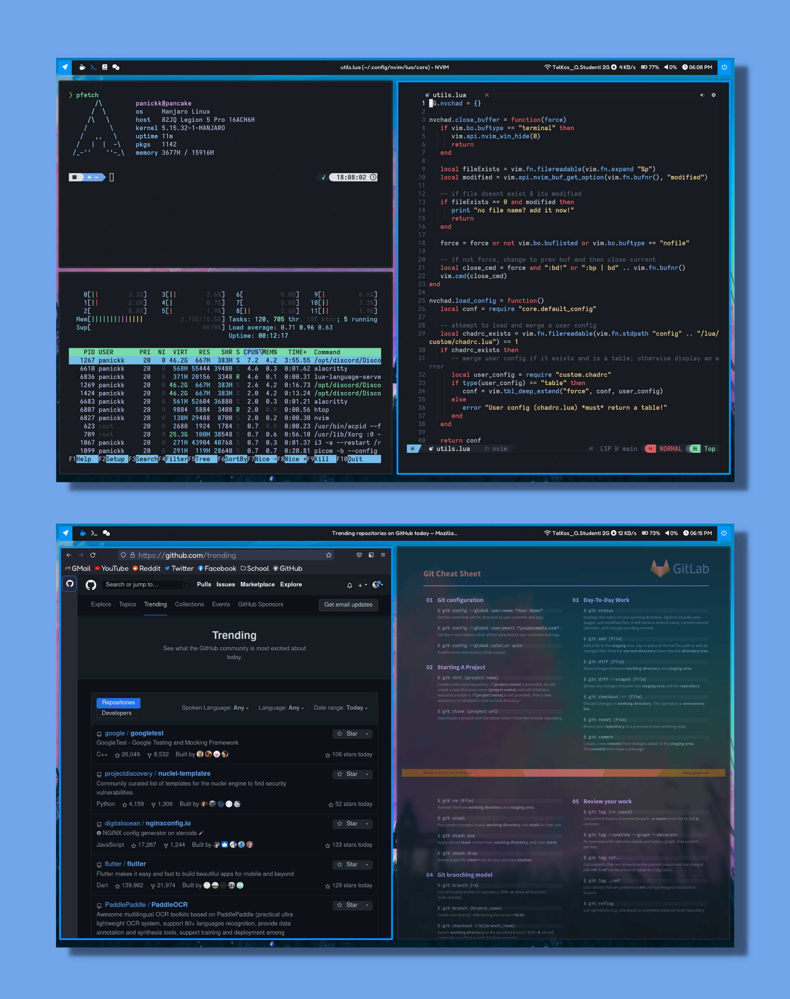
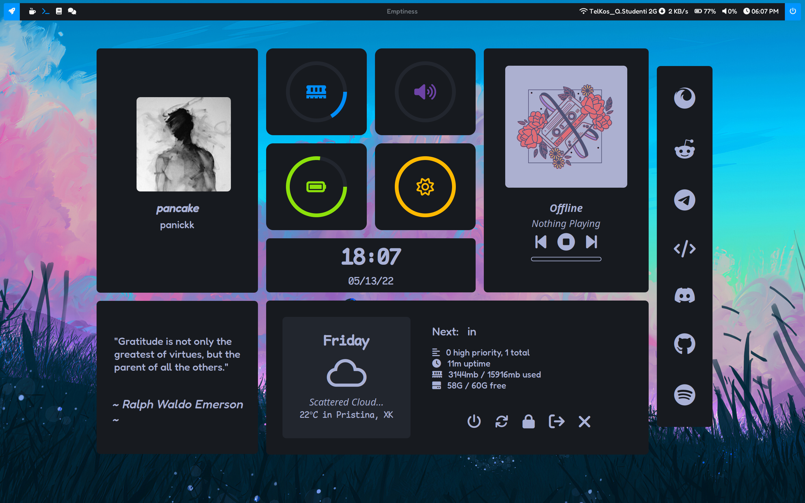

<h1 align="center">PanicKk's I3WM rice!<h1>

  

    

# :milky_way: <samp>INFORMATION</samp>

# :wave: Welcome
### :bullettrain_front: You have now reached the destination of my personal i3wm rice dotfiles :)
It has been one hell of a crazy journey untill I was able to get my way around good ricing.

I am finally able to say that I am happy with what I have created, 
with the inspiration from the great community of [ricers](https://www.reddit.com/r/unixporn) and the hard work of the people listed [below](#-credits).
    
    

# :cyclone: Software Information ~

- **OS:** [Manjaro Linux (arch linux wannabe)](https://manjaro.org/download/#i3)
- **WM:** [i3](https://i3wm.org/)
- **Terminal:** [Alacritty](https://github.com/alacritty/alacritty)
- **Shell:* [zsh](https://ohmyz.sh/)
- **Bar:** [Eww](https://github.com/elkowar/eww), [Polybar](https://github.com/polybar/polybar)
- **Compositor:** [Picom](https://github.com/ibhagwan/picom-ibhagwan-git)
- **Text Editor:** [Neovim](https://neovim.io/)
- **File Manager:** [Thunar](https://docs.xfce.org/xfce/thunar/start)
- **Browser:** [Brave](https://brave.com/), [Firefox](https://www.mozilla.org/en-US/firefox/new/)
- **Application Launcher:** [rofi](https://github.com/davatorium/rofi)
    
     

# Showcase
### Dashboard

### Bars - | -

<!-- CREDITS -->
## :sparkles: <samp>CREDITTS</samp>
#### :gem: I appreciate every creator of the repos listed below! Their hard work and creativity are a main fact that make my linux workspace very comfy :gem:

| Creator | Repo |
| ----------- | ----------- |
| [@siduck](https://github.com/siduck/) | [NvChad](https://github.com/NvChad/NvChad) |
| [@rxyhn](https://github.com/rxyhn/) | [eww bar](https://github.com/rxyhn/bspdots) |
| [@rxyhn](https://github.com/rxyhn/) | [eww dashboard](https://github.com/rxyhn/bspdots) |
| [@janleigh](https://github.com/janleigh/) | [eww sidecard](https://github.com/janleigh/dotfiles)
| [@adi1090x](https://github.com/adi1090x/) | [polybar](https://github.com/adi1090x/polybar-themes) |
| [@adi1090x](https://github.com/adi1090x/) | [rofi](https://github.com/adi1090x/rofi) |
| [@elianiva](https://github.com/elianiva) | [random-jp-api](https://github.com/elianiva/random-jp-api)

 

>\*Notice: All of the content above is slightly modified to match my needs, so you can relate to their personal repos for more accuracy :)
